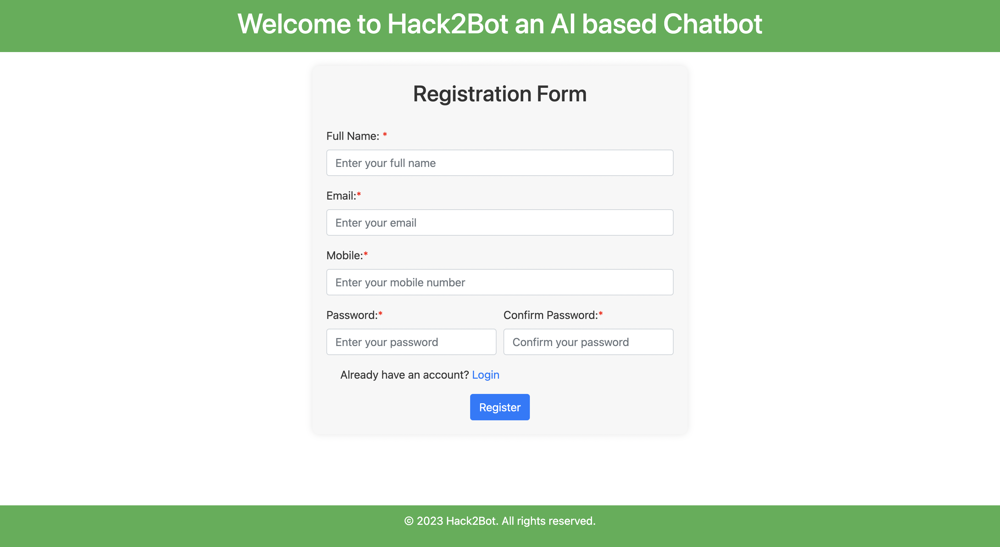
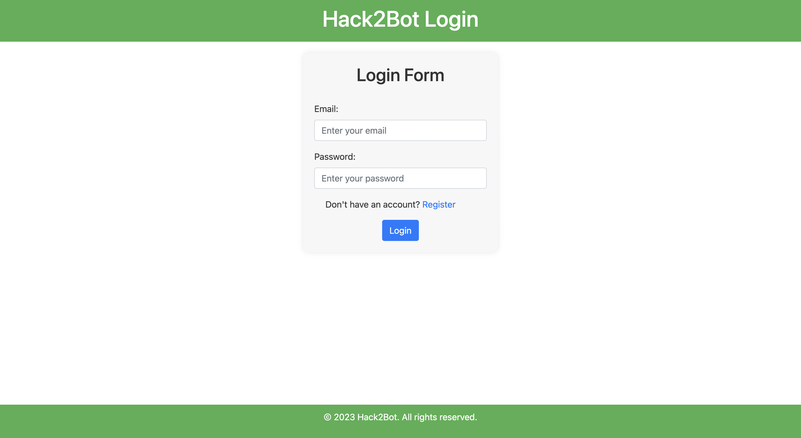
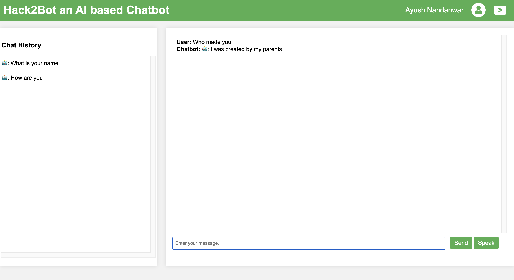

# Hack2Bot an AI based Chatbot
## Integrated with ChatGPT

### 1 Registration Page

### 1 Login Page

### 1 Chat Page


## Steps to Run Project

You need to create API_KEY from [platform.openai.com](https://platform.openai.com/)

Create config.env file in project

### Add following in file

```
DATABASEURL = YOUR_MONGO_URL
JWT_SECRET = YOUR_JWT_SECRET_KEY
API_KEY = YOUR_GPT_API_KEY
```

### Open Terminal and run following command

```
npm install
npm run start
```

### Thank You for visiting my repository 